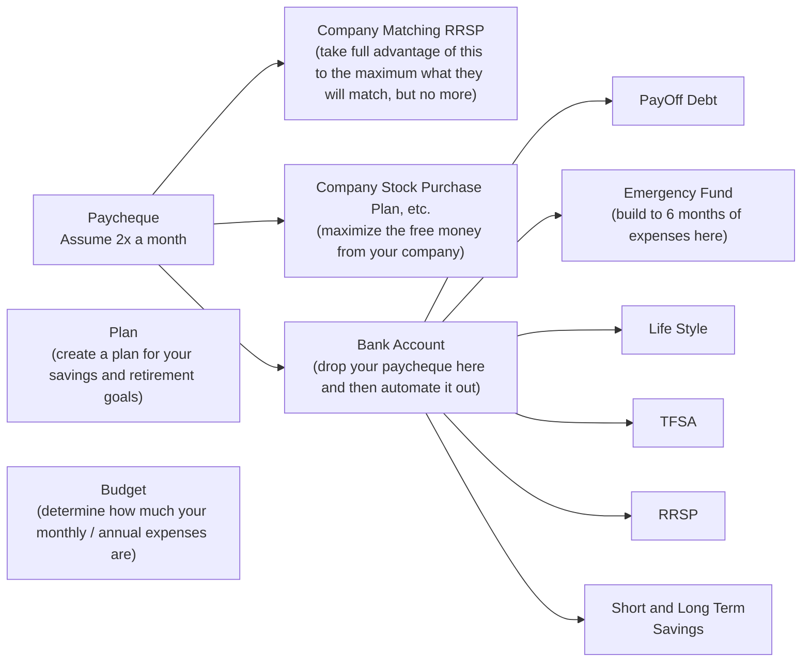

# Your Financial Journey

Some ideas to guide, navigate and support your financial journey.

- Table of Contents
{:toc}

Last updated: {{ page.last_updated_at }}

# Motivation

The goal of this book is to get you to financial independence.
Financial independence gives you choices
- What job to have
- Whether you even want a job
- What you want to spend your time on
- Who you want to spend your time with
- Where to spend your time
- Better health care
- Better life
- Everything is better if you have financial independence

Note that the pursuit of money is the root of all evil.
- Do not be evil.
- Be financially independent and lead a good life.
- Treasure family and friends.

## Disclaimers

- This is not financial advice - it is support, education and/or entertainment.
- Your situation will be different that others.
- Take the guidance in this document and choose what and how to apply it to your own journey.
- This document is NOT responsible for your financial journey.
- This document is the starting point; not the ending point.
- You, and only you, are responsible for your financial journey.
- This document discusses tax rates, etc.
	- This will change over time and so this book will age and need to be refreshed periodically.
- Some of the content is very much Canadian centric.

All original content in this document is copyrighted and may not be reproduced without written permission.

There is no warranty implied in this document.  You own your own financial journey.

## Levels of Financial Independence

|                                           | Name                                | Description                                                                                                                                                                                                                                                                                                                                                                      |
| :---------------------------------------: | ----------------------------------- | -------------------------------------------------------------------------------------------------------------------------------------------------------------------------------------------------------------------------------------------------------------------------------------------------------------------------------------------------------------------------------- |
| 00 | **Financial Dependency**            | Debt and living expenses greater than your income                                                                                                                                                                                                                                                                                                                                |
| 01 | **Financial Solvency**              | Current on debt payments Meet financial commitments without outside help                                                                                                                                                                                                                                                                                                      |
| 02 | **Financial Stability**             | Built three-to-six-month emergency fund                                                                                                                                                                                                                                                                                                                                          |
| 03 | **Debt Freedom**                    | Could be no debt or just no mortgage or no credit card                                                                                                                                                                                                                                                                                                                           |
| 04 | **Coasting Financial Independence** | Also known as 	- Freedom from Employer 	- Barista Financial Independence 	- Agency Could step down from a higher paying job to a lower paying job that you enjoy more Have enough invested that will grow to a level that is good enough for retirement at a pre-determined age, even if no more is added to the investment So can coast through to retirement |
| 05 | **Financial Security**              | Cash flow from investments can provide your basic survival expenses Food, water, shelter, clothing, insurance Just survival                                                                                                                                                                                                                                                |
| 06 | **Financial Flexibility**           | Live off current cash flow assuming that you have a flexible spending plan to account for market fluctuations Roughly half of full financial independence                                                                                                                                                                                                                     |
| 07 | **Financial Independence**          | 4% rule - [https://en.wikipedia.org/wiki/Trinity_study ](https://en.wikipedia.org/wiki/Trinity_study ) You have saved 25x your annual expenses 100,000 \* 25 = 2,500,000  2,500,000 \* 4% = 100,000                                                                                                                                                                     |
| 08 | **Financial Freedom**               | Can add in more life goals than previous level Add in some dreams                                                                                                                                                                                                                                                                                                             |
| 09 | **Financial Abundance**             | Cash flow from investment is more than you will even need 3x financial freedom number                                                                                                                                                                                                                                                                                         |

Reference: [https://www.youtube.com/watch?v=kDSHHiFMJ_I ](https://www.youtube.com/watch?v=kDSHHiFMJ_I )

## Executive Summary

We Will End Up With
- A financial flowchart
- A Do-It-Yourself (DIY) / self-directed online brokerage
- Accounts that we need (TFSA, RRSP, RESP, etc.) in the online brokerage
- Purchase low cost, broadly diversified index funds in the above created accounts
- Purchase new funds every pay cheque
- A buy and hold attitude to the funds - we are not going to actively manage them
- DRIP enabled funds so that we get compounding
- We will rebalance once or twice a year if/as needed
- A plan for when to retire
- A plan for how to transfer your estate

## Starting Early

- Compounding is the eighth wonder of the world – Albert Einstein.
- Start early and you can get compunding working for you.
- Start late and you lose out to the advantages.
- Compunding can allow your money to earn more than your annual salary for you.

[https://www.rbcgam.com/en/ca/learn-plan/retirement-resources/the-importance-of-starting-early/detail](https://www.rbcgam.com/en/ca/learn-plan/retirement-resources/the-importance-of-starting-early/detail)

|                            | Scenario A                                         | Scenario B                                            | Scenario C           |
| -------------------------: | -------------------------------------------------- | ----------------------------------------------------- | -------------------- |
|                            | Invest for 10 years. Then nothing for 30 years. | Do nothing for 10 years. Then invest for 30 years. | Invest for 40 years. |
|         **Monthly Amount** | $100                                               | $100                                                  | $100                 |
|   **Annual Interest Rate** | 7%                                                 | 7%                                                    | 7%                   |
|    **Interest Compounded** | Monthly                                            | Monthly                                               | Monthly              |
| **At The End of 40 Years** | $140,480                                           | $121,997                                              | $262,481             |
|     **Your Contributions** | $12,000                                            | $36,000                                               | $48,000              |
|  **Total Interest Earned** | $128,481                                           | $85,997                                               | $214,481             |
|         **Overall Growth** | 1,171%                                             | 339%                                                  | 547%                 |

[https://www.getsmarteraboutmoney.ca/calculators/compound-interest-calculator/ ](https://www.getsmarteraboutmoney.ca/calculators/compound-interest-calculator/ )

Key Take Away
- Investing for 10 years and then doing nothing is better than doing nothing for 10 years and then investing for 30 years
- Start early
- Compounding works

# Stage 01: Wealth Accumulation

## Goal

- Earning income
- Grow your portfolio to become financially independent
- Make informed decisions
- Enjoy life

## Considerations

- Planning
- Budgeting
- Bank Account Management
- Emergency Fund
- Employer RRSP Matching
- Employer Stock Purchase Plan
- Index Investing
- Asset Allocation
- TFSA and RRSP
- RESP
- Home Ownership

## Flowchart

[Flow chart](../assets/images/02a_FinancialLiteracy_YourFinancialJourney_Flowchart.jpg)

### Some other flow charts to review:

Reddit Personal Finance Canada
- [https://www.reddit.com/r/PersonalFinanceCanada/wiki/money-steps/](https://www.reddit.com/r/PersonalFinanceCanada/wiki/money-steps/)

Another flowchart
- [https://www.reddit.com/r/PersonalFinanceCanada/comments/10lythh/flowchart_should_i_invest_in_an_rrsp_or_tfsa/?utm_source=share&utm_medium=ios_app&utm_name=iossmf](https://www.reddit.com/r/PersonalFinanceCanada/comments/10lythh/flowchart_should_i_invest_in_an_rrsp_or_tfsa/?utm_source=share&utm_medium=ios_app&utm_name=iossmf)
- [https://i.imgur.com/H2F3f78.png ](https://i.imgur.com/H2F3f78.png )

The High Five Banking Method
- See [here](02d_FinancialLiteracy_HighFiveBanking.md) for more details on how to structure your bank accounts.

## Plan

- Create your initial plan.
	- Does not have to be complex.
	- You will edit and update it many times over your lifetime.
	- Start with the basics.
- Financial Independence (and/or Retirement).
	- When?
	-  How much will your annual expenses be when you retire - take a guess?
- How much money do you have to save each year to get to this retirement goal?
- Who are you planning for?
	- You?
	- Spouse?
	- Kids?
	- Other?

## Budget

- Create a list of your monthly expenses
- This will tell you how much money you need in your Monthly Expenses Bank Account at the start of the month to pay all your bills for the month
- You do not need to budget every small item – make sure that the big items are covered
- Ensure that your own savings is the most important, and first, item you budget for
- Each year end download your bank account and credit card statement to CSV and do a spreadsheet analysis to see where you spent your money
- This will let you know if you need to adjust and will give you your annual expense needs.
- 25x your annual expenses is your retirement number

## Paycheque

- Let’s assume you get paid twice a month
- Directly off your paycheuque take advantage of your employer’s benefits as much as you can and/or makes sense - don't leave money on the table
- Automatically deposit your net pay into your [Bank Account](02d_FinancialLiteracy_HighFiveBanking.md)
- Set up your money transfers to be automatic – the less that you have to worry about it, the better
- Put half your monthly expenses into your [Chequing 01: Bills and Chequing 02: Lifestyle](02d_FinancialLiteracy_HighFiveBanking.md) bank accounts – so that when you get to the start of the next month you have cash in this account to pay all bills
- Transfer money to your various savings goals
- Once all your planned transfers are made, the money left over, is your free money – enjoy life

## Savings Goals

|                    | Description                                                                                                                                                  |
| -----------------: | ------------------------------------------------------------------------------------------------------------------------------------------------------------ |
|    **Payoff Debt** | Pay off any debt that you may have                                                                                                                           |
| **Emergency Fund** | Build your emergency fund until you have a few months of emergency cash. If you have TFSA room, use your TFSA to hold your emergency fund to avoid taxes. |
|           **TFSA** | If you are making less than $50K per year, maximize your TFSA first                                                                                          |
|           **RRSP** | Maximize your RRSP next                                                                                                                                      |
|  **Extra Savings** | Save for any other things that you may want – vacations, cars, etc.                                                                                          |

TODO: Add in FHSA and saving in your TFSA during the year and transfer to other by year end.

## Emergency Fund

### Why?
- Life is unpredictable
- Job loss or other significant factors could impact your financials
- Having an emergency fund to protect yourself is essential

### How?
- Determine your one-month expenses
- Save money to cover one months of expenses
	- Then three months
	- Then six months

### Where?
- This money should be cash, not an investment
- Saved in a high interest savings account
- Or in a TFSA (as cash) to avoid paying taxes, if you have the room

### More Information
- [Canada.ca: Setting up an emergency fund](https://www.canada.ca/en/financial-consumer-agency/services/savings-investments/setting-up-emergency-funds.html)
- [MoneySense.ca: What is an emergency fund and how to build one](https://www.moneysense.ca/save/budgeting/what-is-an-emergency-fund-and-how-to-build-one/)
- [Ratehub.ca: What is an emergency fund and why it's important](https://www.ratehub.ca/blog/what-is-an-emergency-fund/)

## Investing Definitions

|                                | Definition                                                                              |
| -----------------------------: | --------------------------------------------------------------------------------------- |
|                      **Stock** | A part ownership in a company.                                                          |
|                       **Fund** | A collection of stocks.                                                                 |
|                      **Index** | A collection of stocks that represent a market segment.                                 |
|                 **Index Fund** | A fund that mimics an index.                                                            |
| **ETF (Exchange Traded Fund)** | A fund (or an index fund) that is traded on the stock market.                           |
|                       **DRIP** | Dividend Re-Investment Plan – automatically re-invest dividends to purchase more units. |
|                        **SIP** | Systematic Investment Plan – regular (weekly, biweekly, monthly, etc.) purchases.       |
|                  **Rebalance** | Adjust your mix of investments to achieve your target allocation.                       |

## Mutual Funds vs Index Funds vs ETFs

|                                    | Mutual Funds                                       | Index Mutual Funds                                                                                                                                                                                                                                                                                                                                                                                                                                                                                                                                                               | ETFs (Exchange Traded Fund)                                                                                                                                                                                                                                                                                      |
| ---------------------------------: | -------------------------------------------------- | -------------------------------------------------------------------------------------------------------------------------------------------------------------------------------------------------------------------------------------------------------------------------------------------------------------------------------------------------------------------------------------------------------------------------------------------------------------------------------------------------------------------------------------------------------------------------------- | ---------------------------------------------------------------------------------------------------------------------------------------------------------------------------------------------------------------------------------------------------------------------------------------------------------------- |
|                **Big Achievement** | Groups of stocks                                   | Group of stocks that just mimics an index and bought on the stock exchange at the end of the day. No need for fancy strategies.                                                                                                                                                                                                                                                                                                                                                                                                                                               | Group of stocks that are traded on the stock exchange through out the day.                                                                                                                                                                                                                                       |
|                         **Tracks** | Varies                                             | An index                                                                                                                                                                                                                                                                                                                                                                                                                                                                                                                                                                         | Varies but often an index                                                                                                                                                                                                                                                                                        |
|                        **Managed** | Actively                                           | Passively                                                                                                                                                                                                                                                                                                                                                                                                                                                                                                                                                                        | Depends whether it is based on a mutual fund or an index fund                                                                                                                                                                                                                                                    |
|                         **Trades** | End of day                                         | End of day                                                                                                                                                                                                                                                                                                                                                                                                                                                                                                                                                                       | During the day                                                                                                                                                                                                                                                                                                   |
| **Management Expense Ratio (MER)** | High – ~1% to ~2%                                  | Low – ~0.36% to ~0.41%                                                                                                                                                                                                                                                                                                                                                                                                                                                                                                                                                           | Lower yet - ~0.12% to ~0.25%                                                                                                                                                                                                                                                                                     |
|               **Transaction Fees** | Depends on online brokerage - usually nothing      | Depends on online brokerage - usually nothing                                                                                                                                                                                                                                                                                                                                                                                                                                                                                                                                    | Zero to $9.99 per trade, depending on the online brokerage                                                                                                                                                                                                                                                       |
|                **Ease of Trading** | Orders can be placed in dollar amounts at any time | Orders can be placed in dollar amounts at any time                                                                                                                                                                                                                                                                                                                                                                                                                                                                                                                               | Often have to buy whole shares unless the brokerage offers fractional shares.                                                                                                                                                                                                                                    |
|  **Automatic Monthly Investments** | Yes                                                | Yes                                                                                                                                                                                                                                                                                                                                                                                                                                                                                                                                                                              | Typically no, but depends on the online brokerage                                                                                                                                                                                                                                                                |
|                    **Rebalancing** | Depends on the fund                                | Depends on the fund                                                                                                                                                                                                                                                                                                                                                                                                                                                                                                                                                              | Depends on the fund                                                                                                                                                                                                                                                                                              |
|                       **Examples** | n/a                                                | [TDB900](https://www.td.com/ca/en/asset-management/funds/solutions/mutual-funds/fundcard?fundId=3261&fundname=TD-Canadian-Index-Fund---e), [TDB902](https://www.td.com/ca/en/asset-management/funds/solutions/mutual-funds/fundcard?fundId=3270&fundname=TD-U.S.-Index-Fund---e), [TDB909](https://www.td.com/ca/en/asset-management/funds/solutions/mutual-funds/fundcard?fundId=4817&fundname=TD-Canadian-Bond-Index-Fund---e), [TDB911](https://www.td.com/ca/en/asset-management/funds/solutions/mutual-funds/fundcard?fundId=4877&fundname=TD-International-Index-Fund---e) | [VEQT](https://www.vanguard.ca/en/product/etf/asset-allocation/9692/vanguard-all-equity-etf-portfolio), [VGRO](https://www.vanguard.ca/en/product/etf/asset-allocation/9579/vanguard-growth-etf-portfolio), [VBAL](https://www.vanguard.ca/en/product/etf/asset-allocation/9578/vanguard-balanced-etf-portfolio) |

[https://www.youtube.com/watch?v=vGcOGYkttI4 ](https://www.youtube.com/watch?v=vGcOGYkttI4 )

[https://canadiancouchpotato.com/getting-started ](https://canadiancouchpotato.com/getting-started )

## Growth

Your investments generally have one of three ways to grow.

|                   | Description                                                                                                                                                                                                                                                                                                                                                                                                                                                                                                                                                                           |
| ----------------: | ------------------------------------------------------------------------------------------------------------------------------------------------------------------------------------------------------------------------------------------------------------------------------------------------------------------------------------------------------------------------------------------------------------------------------------------------------------------------------------------------------------------------------------------------------------------------------------- |
|      **Interest** | Guaranteed return from loaning someone your money. Fully taxed (in a non-registered account).                                                                                                                                                                                                                                                                                                                                                                                                                                                                                      |
|     **Dividends** | A company sharing some of their profits with you (an owner of the company). Preferentially taxed (in a non-registered account). In the case of eligible Canadian dividends may not be taxed at all until after ~$50k [https://www.taxtips.ca/taxrates/canada.htm](https://www.taxtips.ca/taxrates/canada.htm)                                                                                                                                                                                                                                                                |
| **Capital Gains** | The value of the company getting higher and thus the stock price getting higher. 50% is not taxed (in a non-registered account). [https://www.wealthsimple.com/en-ca/learn/capital-gains-tax-canada#what_is_a_capital_gain_or_capital_loss](https://www.wealthsimple.com/en-ca/learn/capital-gains-tax-canada#what_is_a_capital_gain_or_capital_loss) [https://www.canada.ca/en/revenue-agency/services/forms-publications/publications/t4037/capital-gains.html](https://www.canada.ca/en/revenue-agency/services/forms-publications/publications/t4037/capital-gains.html) |

## Active vs Passive Investing

|                     | Active Investments                                                                                                                                                                                                                                                                                                 | Passive Investments                                                                                                        |
| ------------------: | ------------------------------------------------------------------------------------------------------------------------------------------------------------------------------------------------------------------------------------------------------------------------------------------------------------------ | -------------------------------------------------------------------------------------------------------------------------- |
|      **Philosophy** | A trained fund manager can pick stocks and beat the market                                                                                                                                                                                                                                                         | Just buy the market / index – it is very unlikely that a trained fund manager can beat the market                          |
|          **People** | A team of analysts / traders / et al                                                                                                                                                                                                                                                                               | Very small team                                                                                                            |
| **What Do They Do** | Watch the market Analyze companies Sell and buy stocks to try to be ahead of the market                                                                                                                                                                                                                      | Buy what is in the index No sales unless the index changes (rare) or rebalancing (if needed)                            |
|            **Goal** | Beat the market by trading stocks and being better than the market                                                                                                                                                                                                                                                 | Match the market, no need for active trading                                                                               |
|            **Fees** | High (2% to 3%) as the team of people employed must be paid                                                                                                                                                                                                                                                        | Low (~0.5%) as there are very few people to pay                                                                            |
|         **Success** | Low The vast majority of funds, do not beat the market - [spiva](https://www.spglobal.com/spdji/en/research-insights/spiva/) The few that do, rarely beat the market + the fees You can’t know beforehand which funds will beat the market Past performance is not an indication of future performance | High Just match the market and keep the fees low [spiva](https://www.spglobal.com/spdji/en/research-insights/spiva/) |

## Fees

|                                     | Description                                                                                                                                                                                   |                     Advice                      |
| ----------------------------------: | --------------------------------------------------------------------------------------------------------------------------------------------------------------------------------------------- | :---------------------------------------------: |
|                      **Front Load** | Money you pay to the fund company when you purchase the fund. Often used to kick back to your financial advisor for getting you to purchase that fund.                                     |  Avoid   |
|                       **Back Load** | Money you pay to the fund company when you sell the fund. Often used to kick back to your financial advisor for getting you to purchase that fund.                                         |  Avoid   |
|           **Deferred Sales Charge** | Money you pay to the fund company if you sell the fund before a certain number of years (~5 – 7). Often used to kick back to your financial advisor for getting you to purchase that fund. |  Avoid   |
|                     **Transaction** | Money to trade (purchase or sell) a fund at the online brokerage. Each brokerage has a different fee plan – make sure that it aligns to your needs.                                        | Minimize |
| **Management Expense Ration (MER)** | Money you pay to the fund company to manage the fund. Active management  higher costs Passive management  lower costs                                                                 | Minimize |

### Management Expense Ration (MER)

If you have a portfolio of a certain size (see below) and a MER of a certain size (see below) here is how much money you would pay **each year** in MER fees.

|          |  $100K |   $500K |    $1MM |
| -------: | -----: | ------: | ------: |
| **0.1%** |   $100 |    $500 |  $1,000 |
| **1.0%** | $1,000 |  $5,000 | $10,000 |
| **2.0%** | $2,000 | $10,000 | $20,000 |
| **3.0%** |  $3000 | $15,000 | $30,000 |

Notes
- Keep your MER low.
- As your portfolio rises in value a higher MER can cost you a significant amount of money.
- This is a fee **each** year.
- And this fee means that the amount of money left in your account does not compound.
- At $1MM and 3.0% in MER you are paying someone a car each year - are you really getting value for this?

If you pay your MER over **20 years** and assuming that your rate of return of return is **6.0%** this is how much your fees would cost you.

| Percentage |    $100K |    $500K |       $1MM | Percentage Loss |
| ---------: | -------: | -------: | ---------: | --------------: |
|   **0.1%** |   $5,997 |  $29,986 |    $59,973 |              3% |
|   **1.0%** |  $55,384 | $276,919 |   $553,838 |             25% |
|   **2.0%** | $101,601 | $508,006 | $1,016,012 |             46% |
|   **3.0%** | $140,102 | $700,512 | $1,401,024 |             63% |

Make sure that you understand the above table
- If you pay 0.1% in fees on a $1MM portfolio over 20 years you will lose 3% of your total potential portfolio to fees.  Meaning that you will keep 97% of your money.
- If instead, you pay 3% in fees you will lose over half your portfolio (63%).
- A 3% fee does not sound large but compounded over time it adds up and eats away at your portfolio.
- Pay attention to minimizing your fees.
- If you get your total portfolio fee into the 0.25% then you are good enough.  You do not need to get it to 0.1% as it gets harder and harder to minimize fees to closer you get to zero.

To run the numbers yourself see: [Larry Bates T-Rex Score](https://larrybates.ca/t-rex-score/).

## Account Management Types

|                          | Description                                                                                                                                               | Pros                                                                                          | Cons                                                                                                                                                                                                    |
| -----------------------: | --------------------------------------------------------------------------------------------------------------------------------------------------------- | --------------------------------------------------------------------------------------------- | ------------------------------------------------------------------------------------------------------------------------------------------------------------------------------------------------------- |
|         **Full Service** | Pay someone at a bank or investment firm to give you advice and manage your investments for you.                                                          | Hands off. Someone will guide you each step of the way.                                    | Highest cost. Need to meet (phone / face-to-face) with your advisor to adjust your investments. Conflict of interest – they get paid based on what they convince you to purchase in your account. |
|             **Fee Only** | Pay someone for their time to advise you on what to invest in. You go out and buy the investmetns yourself.                                            | No conflict of interest.                                                                      | Hard to find.                                                                                                                                                                                           |
|         **Robo-Advisor** | A computer program asks you questions and devises an investment plan for you based on an algorithm and executes the investing for you.                    | Lower cost. Standardized algorithms.                                                       | The medium place.                                                                                                                                                                                       |
|     **Asset Allocation** | Purchase an asset allocation fund that automatically rebalances for you – e.g. [Canadian Couch Potato](https://canadiancouchpotato.com/model-portfolios/) | Simple – buy one thing. Relatively cheap. Easy to do in a Do It Yourself (DIY) account. | Very little.                                                                                                                                                                                            |
| **Do It Yourself (DIY)** | You pick what to invest in.  This could (and often should) just be the **Asset Allocation** choice above.                                                 | Lowest cost. Can invest in whatever you wish to.                                           | You must make your own decisions. You must rebalance yourself.                                                                                                                                       |

## Asset Allocation
- An “asset” is a general term for your investments – stocks, mutual funds, index funds, ETFs, etc.
- Assets can be broken down into multiple categories
	- By size of the company
	- By geography
	- etc.
- The following is a typical breakdown.

|                            | Summary                               | Details                                                                      | Examples          |
| -------------------------: | ------------------------------------- | ---------------------------------------------------------------------------- | ----------------- |
|                   **Cash** | Cash and cash equivalents.            | Safe but loses buying power over time as inflation reduces its buying power. | Cash in the bank. |
|           **Fixed Income** | Bonds and other “secure” investments. | Relative secure and used to offset equity volatility.                        | Bond funds.       |
|       **Candian Equities** | Canadian stocks.                      | Stocks in Canadian companies – can be volatile.                              | TD, Bell, Rogers. |
|           **USA Equities** | USA stocks.                           | Stocks in USA companies – can be volatile.                                   | Facebook, Amazon. |
| **International Equities** | International stocks.                 | Stocks in International companies – can be volatile.                         |                   |
|       **Emerging Markets** | Newly developing countries.           | Stocks in newly developing companies – can be volatile.                      |                   |

### Asset Allocation Heuristics
- The safe portion of your portfolio (cash and fixed income) should be equivalent to your age.
	- But also need to consider your risk tolerance.
- If you are young, you are more heavily weighted to equities as this will be where your growth comes from and you have the luxury of time to recover from market downturns.
- If you are less young, there are arguments to move your portfolio more towards safer investments to avoid risk if the market goes down.
- Cash and Fixed Income is often combined into one category.
- International Equities and Emerging Markets are often combined into one category.
- There are some things to consider with this
	- What is your ability to handle risk?
		- Need to take risk.
		- Ability to take risk.
		- Tolerance to take risk.
	- Note that some people think that you should move to a "safer" mix by the time that you retire.
		- Some will use a cash wedge (TODO Add link to section).
- Each year (or every half year or if an extraordinary situation occurs) you would rebalance to your target allocation.

## Asset Location
The idea behind asset location is that by putting specific funds into specific locations you can minimize your taxes as some locations are treated differently in the Canadian tax code.

This is not something for the beginner:
- In a small portfolio is it not worthwhile – the money you save / make is not offset by the complexity.
- If you are not maximzing your RRSPs and TFSAs and having a substantial amount in a non-registered account then this idea may not be for you.
- Trying to be too smart can lead to lower returns.
- Feel free to ignore this until you are more seasoned and can decide if this is worthwhile or not.
- Just skip this section.

|                        | Key Ideas                                                                                                                                                                                                                                                                                                                              | Consider Holding                                                                                                                                                                                                                                                                                                                                                                                                                                                                                              | Consider Avoiding                                                                                                                                                                                                                                                                                                                                                                                            |
| ---------------------: | -------------------------------------------------------------------------------------------------------------------------------------------------------------------------------------------------------------------------------------------------------------------------------------------------------------------------------------- | ------------------------------------------------------------------------------------------------------------------------------------------------------------------------------------------------------------------------------------------------------------------------------------------------------------------------------------------------------------------------------------------------------------------------------------------------------------------------------------------------------------- | ------------------------------------------------------------------------------------------------------------------------------------------------------------------------------------------------------------------------------------------------------------------------------------------------------------------------------------------------------------------------------------------------------------ |
| **RRSP / RRIF / LIRA** | Money contributed reduces your taxable income.  Money grows tax free.  Money withdrawn at ordinary income (like your pay cheque) rates which are usually the highest.  Canadian / USA treaty there is an exemption from the USA withholding tax on interest and dividend income that is earned from USA investments. | **Canadian and USA Interest** (bonds, GICs, T-bills, etc.)  **USA Dividends**                                                                                                                                                                                                                                                                                                                                                                                                                           | **Foreign (non-USA) Interest and Dividends** – as there may be withholding taxes paid that cannot be recovered via the foreign tax credit  **Canadian Dividends** – as you cannot claim the Canadian dividend tax credit .  **Capital Gains** – as you cannot claim the capital gain (or loss) in the account and when you withdraw the money you will be paying taxes at ordinary income rates. |
|               **TFSA** | Money contributed does not reduce your taxable income.  Money grows tax free.  Money withdrawn without tax.  No Canadian / USA treaty in place as a TFSA account is not considered a retirement account.                                                                                                             | **Canadian and USA Interest** (bonds, GICs, T-bills, etc.).  **Canadian Dividends** – can’t claim the Canadian dividend tax credit but the dividends are not taxed.  **Capital Gains** – as there will be no taxes paid.                                                                                                                                                                                                                                                                          | **USA and Foreign Dividends / Foreign (non-USA) Interest** – as there may be withholding taxes paid that cannot be recovered.  **Capital Losses** – as you cannot claim a capital loss to offset other capital gains as well losses within this account will not give you more contribution room.                                                                                                      |
|    **Non Retgistered** | Money contributed does not reduce your taxable income.  Money grown is taxed each year.                                                                                                                                                                                                                                          | **Capital Gains** – as they are preferentially taxed.  **Capital Losses** – as they can be used to offset capital gains.  **USA and Foreign Dividends** – although they will be fully taxed you can may be able to use the Canadian foreign tax credits to offset some of these.  **Return of Capital** – as they reduce your cost base which can result in a larger capital gain or smaller capital loss which will allow you to benefit from the preferential tax rates on capital gains. | **Canadian and Foreign Interest** – as they are fully taxed in this account.                                                                                                                                                                                                                                                                                                                                 |

For more information see here:
- [https://www.pwlcapital.com/resources/asset-location-uncertainty](https://www.pwlcapital.com/resources/asset-location-uncertainty)
- [https://www.pwlcapital.com/resources/optimal-asset-location](https://www.pwlcapital.com/resources/optimal-asset-location)
- [https://www.reddit.com/r/CanadianInvestor/comments/10vkav6/asset_location_guide/?utm_source=share&utm_medium=ios_app&utm_name=iossmf ](https://www.reddit.com/r/CanadianInvestor/comments/10vkav6/asset_location_guide/?utm_source=share&utm_medium=ios_app&utm_name=iossmf )

Remember that this is a complex strategy and most often you will do yourself more harm than good by trying to implement this strategy, especially at lower portfolio values.

Proceed with an abundance of caution.

## TFSA and RRSP

|                                 | TFSA                                                                                                                                                                                                                            | RRSP                                                                                                                                                                                                                                              |
| ------------------------------: | ------------------------------------------------------------------------------------------------------------------------------------------------------------------------------------------------------------------------------- | ------------------------------------------------------------------------------------------------------------------------------------------------------------------------------------------------------------------------------------------------- |
|                        **Link** | [Canada.ca](https://www.canada.ca/en/revenue-agency/services/forms-publications/publications/rc4466/tax-free-savings-account-tfsa-guide-individuals.html)                                                                       | [Canada.ca](https://www.canada.ca/en/revenue-agency/services/forms-publications/publications/t4040/rrsps-other-registered-plans-retirement.html)                                                                                                  |
|      **Taxes on Contributions** | No savings on taxes when money is contributed.                                                                                                                                                                                  | Lowers your net taxable income by your current marginal tax rate.                                                                                                                                                                                 |
|             **Taxes on Growth** | Tax free.                                                                                                                                                                                                                       | Tax free.                                                                                                                                                                                                                                         |
|        **Taxes on Withdrawals** | None                                                                                                                                                                                                                            | Pay tax at your future marginal tax rate the same as “ordinary income”.                                                                                                                                                                           |
| **Maximum Annual Contribution** | Same maximum for all individuals for each year.  [Canada.ca](https://www.canada.ca/en/revenue-agency/services/forms-publications/publications/rc4466/tax-free-savings-account-tfsa-guide-individuals.html#contributions)  | 18% of last year's earned income to a maximum.  [Canada.ca](https://www.canada.ca/en/revenue-agency/services/tax/individuals/topics/rrsps-related-plans/contributing-a-rrsp-prpp/contributions-affect-your-rrsp-prpp-deduction-limit.html ) |
|                        **Misc** | [Beneficiary vs Success Holder](https://www.planeasy.ca/tfsa-beneficiary-vs-successor-holder-the-difference-is-huge/)  If you have a spouse ensure that your account is set up as a success holder and not a beneficiary. |                                                                                                                                                                                                                                                   |

To benefit from the RRSP tax savings you MUST invest your tax refund.

For example: you get $10,000 at a marginal tax rate of 40%.

|                       | Invest in TFSA                                                                                     | Invest in RRSP                                                                                                                                                                                                                                                                                                                                                                                                                                                                                                                                                                                                                                 |
| --------------------: | -------------------------------------------------------------------------------------------------- | ---------------------------------------------------------------------------------------------------------------------------------------------------------------------------------------------------------------------------------------------------------------------------------------------------------------------------------------------------------------------------------------------------------------------------------------------------------------------------------------------------------------------------------------------------------------------------------------------------------------------------------------------- |
|             **Today** | Pay the 40% tax $10,000 * 0.4 = $4,000  Invest the remainder $10,000 - $4,000 = $6,000 | Pay the 40% tax rate. Recall that the money that you actually receive on your paycheque actually is already taxed. $10,000 * 0.4 = $4,000  Invest the remainder. $10,000 - $4,000 = $6,000  In April of the following year you get your tax refund of $4,000.  You MUST invest this into your RRSP otherwise the savings from the RRSP is not realized. Note that we are discounting that you can use the $4,000 to do something else to benefit your life. This is just looking at the investment view of the money.  Invest the tax refund of $4,000  So you have now invested the full $10,000 |
|           **Ongoing** | Grow the $6,000 over several years.                                                                | Grow the $10,000 over several years.                                                                                                                                                                                                                                                                                                                                                                                                                                                                                                                                                                                                           |
| **Future Withdrawal** | Withdraw tax free.                                                                                 | Withdraw and pay your marginal tax rates.                                                                                                                                                                                                                                                                                                                                                                                                                                                                                                                                                                                                      |

As for which of the TFSA and RRSP to invest in first this will depend on what your current and future tax rates will be.

|                                   | Description                                                                                                                                                                                                                                                                                                                                                 | Conclusion                    |
| --------------------------------: | ----------------------------------------------------------------------------------------------------------------------------------------------------------------------------------------------------------------------------------------------------------------------------------------------------------------------------------------------------------- | ----------------------------- |
|   **Same Tax Rate in Retirement** | Your marginal tax rate today is the same as your marginal tax rate in the future.  Then it does not matter if you maximize TFSA first or RRSP first.  Your after tax (none for TFSA and marginal for RRSP) gives you the same future income to spend.                                                                                           | Does not matter TFSA or RRSP. |
|  **Lower Tax Rate In Retirement** | Your marginal tax rate today is the lower than your marginal tax rate in the future.  So you are a student or a new employee.  You are not earning much money.  You expect that you will be earning more money in retirement than you are today.  So you would save a small amount of taxes today and pay more taxes in the future. | Maximize TFSA first.          |
| **Higher Tax Rate In Retirement** | Your marginal tax rate today is the higher than your marginal tax rate in the future.  You are at a high-ish point in your earning.  You expect that you will be earning less money in retirement than you are today.  So you would save a large amount of taxes today and pay less taxes in the future.                                  | Maximize RRSP first.          |

With all the above analysis the general conclusion is:
- If you are **earning more today** than you expect to earn in retirement, then maximize **RRSP** first.
- If you are **earning less today** than you expect to earn in retirement, then maximize **TFSA** first.

While the above is a good general rule to consider, please be aware that in retirement it would be expected that you would have a tax efficient withdrawal strategy:
- You first use Canadian dividends from your portfolio to fund your retirement - eligible Canadian dividends actually have a negative tax rate until $50,197 per person.
- You next consider capital gains to fund your retirement.
- Both dividends and capital gains have lower taxes than your salary today (considered to be "other income").
	- TaxTips.ca - Ontario 2021 & 2022 Personal Income Tax Rates
	- This means that if your salary today is the exact same as your income in retirement, your marginal tax rate in retirement would be lower as you are expected to have a more tax efficient strategy in retirement.

With this further analysis then the above two conclusions can be changed to be
- If your marginal tax rate today is more today than you expected marginal tax rate in retirement to be, then maximize RRSP first.
- If your marginal tax rate today is less today than you expected marginal tax rate in retirement to be, then maximize TFSA first.

If the above is too complex and confusing and you want something simple, here it is
- YES, I can maximize both my TFSA and my RRSP
	- Just do it (maximize both) and don't worry any more
- NO, I cannot maximize both today
	- Are you making the same or more today than you expect to make in retirement
		- Maximize your RRSP first
	- Else
		- Maximize your TFSA first

## RESP

| Age | % Stocks | % Bonds / GIC |
| :-: | -------: | ------------: |
| 00  |       90 |            10 |
| 01  |       85 |            15 |
| 02  |       80 |            20 |
| 03  |       75 |            25 |
| 04  |       70 |            30 |
| 05  |       65 |            35 |
| 06  |       60 |            40 |
| 07  |       55 |            45 |
| 08  |       50 |            50 |
| 09  |       45 |            55 |
| 10  |       40 |            60 |
| 11  |       35 |            65 |
| 12  |       30 |            70 |
| 13  |       25 |            75 |
| 14  |       20 |            80 |
| 15  |       15 |            85 |
| 16  |       10 |            90 |
| 17  |        5 |            95 |
| 18  |        - |           100 |

You’re going to create a glide path:
- Start years old
- End years old
- Think about your risk tolerance and whether you will be able to pay for some of university when the kid is ready and the market drops
- Based on your risk tolerance you will define how “safe” you want to be
- The glide path can be a little more strep wise than full glide if this fits your risk tolerance

Let’s assume that this is your glide path:
- Start at zero years old
- End at 18 years old
- By the end have no stocks

Adjust the ratio as you see fit for your own risk tolerance.

Each year adjust your asset allocation to meet the glide path .

More information can be found here:
- [https://www.youtube.com/watch?v=y70GqxHj8WY&t=6s ](https://www.youtube.com/watch?v=y70GqxHj8WY&t=6s )

## Online Brokerage

Online Brokerage Features to Considerations:
- Does it support the accounts you need - RRSP, TFSA, RESP?
- Can you set up a Systematic Investment Plan (SIP)?
- Does it support DRIP?
- Are there trading fees to consider?
- Does it have the funds that you will want to purchase?
- What is your plan for per paycheque investing?
- What other needs do you have?
	- [https://www.moneysense.ca/save/investing/best-online-brokers-in-canada ](https://www.moneysense.ca/save/investing/best-online-brokers-in-canada )

## Risk

What is Risk?
- Volatility in the market?
- The chance that you do not make your number when you are ready to retire regardless of the volatility along the way?
- Something else?

Three Factors of Risk
- **Need**: Do you need to take on risk?
- **Ability**: Do you have the ability to take on risk?
- **Tolerance**: How will you react to market volatility?

Portfolio
- Use your understanding of your risk level to define a portfolio that will meet your goals.

## Portfolio

Want to know what you should buy in your portfolio?

Here are some good sources:
- Canadian Couch Potato
	- [https://canadiancouchpotato.com ](https://canadiancouchpotato.com )
	- Excellent podcast to help you on your journey
	- Model portfolios to show you what to consider buying
- The Simple Path to Wealth
	- [https://jlcollinsnh.com/stock-series ](https://jlcollinsnh.com/stock-series )
	- One of the top books on index investing
- Bogleheads
	- [Bofleheads video](https://www.bogleheads.org/wiki/Video:Bogleheads%C2%AE_investment_philosophy )
	- John Bogle invented the index fund

Recommended portfolio would be:
- Low cost via index funds and/or ETFs
- Passive investing over active
- Diversified via broad market funds
- Per paycheque purchasing of funds
- DRIP enabled

Still don’t know what to do?  Here is one idea (remember I am not a / your financial planner):
- Decide on your risk tolerance
- Pick one of the following (depending on your risk tolerance) for large lump sum payments
	- Asset allocation funds
		- All equities - [VEQT](https://www.vanguard.ca/en/advisor/products/products-group/etfs/VEQT)
		- 20% bonds - [VGRO](https://www.vanguard.ca/en/advisor/products/products-group/etfs/VGRO)
		- 40% bonds - [VBAL](https://www.vanguard.ca/en/advisor/products/products-group/etfs/VBAL)
	- Canadian dividends if you want
		- Canadian dividends - [VDY](https://www.vanguard.ca/en/advisor/products/products-group/etfs/VDY)
- If your online brokerage charges you for ETF purchases then consider some of the following for your per paycheque purchases so that you are not paying transaction fees each paycheque
	- Bonds – [TDB909](https://www.td.com/ca/en/asset-management/funds/solutions/mutual-funds/FundCard/TD%20Canadian%20Bond%20Index%20Fund%20-%20e/?fundId=4817 )
	- Canadian Equities – [TDB900](https://www.td.com/ca/en/asset-management/funds/solutions/mutual-funds/FundCard/TD%20Canadian%20Index%20Fund%20-%20e/?fundId=3261)
	- USA Equities – [TDB902](https://www.td.com/ca/en/asset-management/funds/solutions/mutual-funds/FundCard/TD%20U.S.%20Index%20Fund%20-%20e/?fundId=3270 )
	- International Equities – [TDB911](https://www.td.com/ca/en/asset-management/funds/solutions/mutual-funds/FundCard/TD%20International%20Index%20Fund%20-%20e/?fundId=4877 )

Now automate it:
- Each paycheque transfer some money into your portfolio accounts (RRSP, TFSA, RESP, etc.).
- And automatically buy your chosen funds.
- Make sure that DRIP is turned on so that dividends are automatically reinvested (note that if your online brokerage charges you for ETF purchases then there is a good chance the ETF DRIPs have no trading commissions – check to be sure).
- Once or twice a year assess to see if you need to rebalance.

## Rebalance

You have a target asset allocation based on your risk profile and a number of other factors.

This ends up being a percentage to each of these allocations:
- Fixed Income / Bonds
- Canadian Equities
- USA Equities
- International Equities

After a few months it is possible that your actual asset allocation has drifted from your target.  In this case you have two options.
- Adjust your per paycheque purchases:
	- If the drift from the target asset allocation is small you can simply adjust your per patcheque purchases.
	- Say that your USA equities are below target, you can then adjust your per paycheque purchases to purchase more of the USA equities to bring you back into your target allocation.
	- This is essence promotes you buying low (USA equities in this example).
- Sell high and buy low:
	- If one asset allocation (say Canadian equities) has gone up and another is low (say USA equities) then you can sell the high one and use that money to buy the low one.
	- This will get you back into alignment with your target asset allocation.

# Stage 02: Wealth Preservation - UNDER CONSTRUCTION

See [Retirement](02b_FinancialLiteracy_Stage02_WealthPreservation.md) for more information.

# Stage 03: Wealth Transfer - UNDER CONSTRUCTION

## Goal

- Transfer your portfolio to your heirs
- You're dead
- How to transfer your portfolio to your heirs in the most efficient (i.e. with least fees) manner possible

## Considerations

- Wills
- Power of Attorney - Financial
- Power of Attorney - Medical
- Trusts
- Life Insurance
- Letter to People

# Appendix

## USA Accounts

|                                    | Traditional IRA (Individual Retirement Account)                            | Roth IRA (Individual Retirement Account)                                                                                                                                              | Traditional 401k                                                                                                                                                                 | Roth 401k                                                                                                                                                                        |
| ---------------------------------: | -------------------------------------------------------------------------- | ------------------------------------------------------------------------------------------------------------------------------------------------------------------------------------- | -------------------------------------------------------------------------------------------------------------------------------------------------------------------------------- | -------------------------------------------------------------------------------------------------------------------------------------------------------------------------------- |
|                    **Description** | Retirement.  Wait until 59.5 years old to withdraw.  Original. | Retirement.  Wait until 59.5 years old to withdraw.  As of 2023, this is not available if you are single and make over US$153k or married and make over US$228k combined. | Retirement just like the Traditional IRA but it is sponsored by your employer.  Hence you get an employer match.  Wait until 59.5 years old to withdraw.             | Retirement just like the Roth IRA but it is sponsored by your employer.  Hence you get an employer match.  Wait until 59.5 years old to withdraw.                    |
|                 **Employer Match** | No                                                                         | No                                                                                                                                                                                    | Yes                                                                                                                                                                              | No                                                                                                                                                                               |
|    **Income Qualification Limits** | No                                                                         | Yes                                                                                                                                                                                   | ??? - don't think so                                                                                                                                                             | No                                                                                                                                                                               |
|          **Taxes on Contribution** | Reduces your taxable income by the amount you contribute.                  | No savings on taxes when money is contributed.                                                                                                                                        | Reduces your taxable income by the amount you contribute.                                                                                                                        | No savings on taxes when money is contributed.                                                                                                                                   |
|                **Taxes on Growth** | Tax free                                                                   | Tax free                                                                                                                                                                              | Tax free                                                                                                                                                                         | Tax free                                                                                                                                                                         |
|           **Taxes on Withdrawals** | Taxable                                                                    | Tax free                                                                                                                                                                              | Taxable                                                                                                                                                                          | Tax free                                                                                                                                                                         |
|    **Maximum Annual Contribution** | 2023: $6,500  Which is a total of Traditional + Roth.                | 2023: $6,500  Which is a total of Traditional + Roth.                                                                                                                           | 2023: US$22,500 per year per employee.  Catch-up if 50 years old or older is US$7,500.  Combined with employer can be US$66k per year (or US$73,500 if 50 or older). | 2023: US$22,500 per year per employee.  Catch-up if 50 years old or older is US$7,500.  Combined with employer can be US$66k per year (or US$73,500 if 50 or older). |
| **Required Minimum Distributions** | Not required                                                               | Not required                                                                                                                                                                          | At 72 years old you are required to withdraw a minimum amount based on life expectancy and account balance.                                                                      | At 72 years old you are required to withdraw a minimum amount based on life expectancy and account balance.                                                                      |
|             **Investment Options** | Typically more options than a 401k                                         | Typically more options than a 401k                                                                                                                                                    | Typically less investment options as compared to an IRA                                                                                                                          | Typically less investment options as compared to an IRA                                                                                                                          |

Backdoor Roth IRA
- Money  -to-  Traditional IRA (non-tax-deductible)  -to-  Roth IRA
- File Form 8606 to let the IRS know that you are not reducing your taxes when contributing to your Traditional IRA
	- [https://www.youtube.com/watch?v=w244kccgl84](https://www.youtube.com/watch?v=w244kccgl84) 
- Used only when your income is above the income limits, otherwise can just contribute to your Roth IRA
- Look up prorata trigger as on 31-Dec of the year that you do the conversion you cannot have cash in one of the other IRA (Traditional, SEP, Simple) when you do the backdoor

References
- [https://www.youtube.com/watch?v=2iUwj4A91Yc ](https://www.youtube.com/watch?v=2iUwj4A91Yc )
- [https://www.forbes.com/advisor/retirement/401k-contribution-limits ](https://www.forbes.com/advisor/retirement/401k-contribution-limits )
- [https://www.youtube.com/results?search_query=rose+han+tax+loopholes](https://www.youtube.com/results?search_query=rose+han+tax+loopholes)
- [https://www.youtube.com/watch?v=vF069x27pGY](https://www.youtube.com/watch?v=vF069x27pGY)
- [https://www.youtube.com/watch?v=Ovua8cC4LqY](https://www.youtube.com/watch?v=Ovua8cC4LqY)
- [https://www.youtube.com/watch?v=tz0Srw_jJh8](https://www.youtube.com/watch?v=Ovua8cC4LqY)

## Version History

|                                           | Date            | Notes               |
| :---------------------------------------: | --------------- | ------------------- |
| 01 | Mon 30-Jan-2022 | Initial version     |
| 02 | Mon 13-Mar-2023 | Second version      |
| 03 | Fri 30-Jun-2023 | Third version       |
| 04 | Thu 14-Mar-2024 | General cleanup     |
| 05 | Sun 9-Aug-2026  | Convert to markdown |

# TODO / Pending

TODO: Add in FHSA