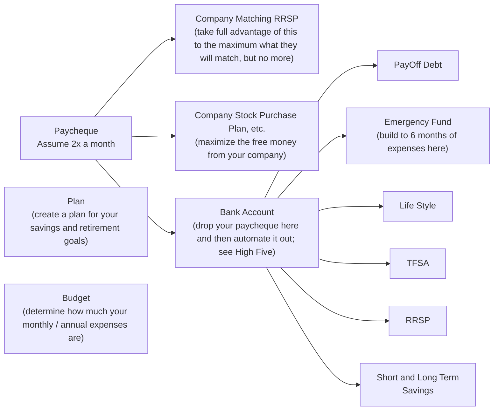

# Stage 01: Wealth Accumulation
---

Some ideas to guide, navigate and support the accumulation of wealth.

- Table of Contents
{:toc}

Last updated: {{ page.last_updated_at }}

# Executive Summary

We Will End Up With
- A financial flowchart
- A Do-It-Yourself (DIY) / self-directed online brokerage
- Accounts that we need (TFSA, RRSP, RESP, etc.) in the online brokerage
- Purchase low cost, broadly diversified index funds in the above created accounts
- Purchase new funds every pay cheque
- A buy and hold attitude to the funds - we are not going to actively manage them
- DRIP enabled funds so that we get compounding
- We will rebalance once or twice a year if/as needed

# Starting Early

See [here](02g_FinancialLiteracy_StartingEarly.md)

# Goal
- Earning income
- Grow your portfolio to become financially independent
- Make informed decisions
- Enjoy life

# Considerations
- Planning
- Budgeting
- [Bank Account Management](02d_FinancialLiteracy_Banking.md)
- [Emergency Fund](#emergency-fund)
- Employer RRSP Matching
- Employer Stock Purchase Plan
- Index Investing
- [Asset Allocation](#asset-allocation)
- [TFSA and RRSP](#tfsa-and-rrsp)
- [RESP](#resp)
- Home Ownership

# Flowchart

[Flow chart](../assets/images/02a_FinancialLiteracy_YourFinancialJourney_Flowchart.jpg)

## Some Other Flow Charts to Review

Reddit Personal Finance Canada
- [https://www.reddit.com/r/PersonalFinanceCanada/wiki/money-steps/](https://www.reddit.com/r/PersonalFinanceCanada/wiki/money-steps/)

Another flowchart
- [https://www.reddit.com/r/PersonalFinanceCanada/comments/10lythh/flowchart_should_i_invest_in_an_rrsp_or_tfsa/?utm_source=share&utm_medium=ios_app&utm_name=iossmf](https://www.reddit.com/r/PersonalFinanceCanada/comments/10lythh/flowchart_should_i_invest_in_an_rrsp_or_tfsa/?utm_source=share&utm_medium=ios_app&utm_name=iossmf)
- [https://i.imgur.com/H2F3f78.png ](https://i.imgur.com/H2F3f78.png )

The High Five Banking Method
- See [here](02d_FinancialLiteracy_Banking.md) for more details on how to structure your bank accounts.

# Plan
- Create your initial plan.
	- Does not have to be complex.
	- You will edit and update it many times over your lifetime.
	- Start with the basics.
- Financial Independence (and/or Retirement).
	- When?
	-  How much will your annual expenses be when you retire - take a guess?
- How much money do you have to save each year to get to this retirement goal?
- Who are you planning for?
	- You?
	- Spouse?
	- Kids?
	- Other?

# Budget
- Create a list of your monthly expenses
- This will tell you how much money you need in your Monthly Expenses Bank Account at the start of the month to pay all your bills for the month
- You do not need to budget every small item – make sure that the big items are covered
- Ensure that your own savings is the most important, and first, item you budget for
- Each year end download your bank account and credit card statement to CSV and do a spreadsheet analysis to see where you spent your money
- This will let you know if you need to adjust and will give you your annual expense needs.
- 25x your annual expenses is your retirement number

# Paycheque

See [here](./02d_FinancialLiteracy_Banking.md)

# Savings Goals

|                    | Description                                                                                                                                                  |
| -----------------: | ------------------------------------------------------------------------------------------------------------------------------------------------------------ |
|    **Payoff Debt** | Pay off any debt that you may have                                                                                                                           |
| **Emergency Fund** | Build your emergency fund until you have a few months of emergency cash. If you have TFSA room, use your TFSA to hold your emergency fund to avoid taxes. |
|           **TFSA** | If you are making less than $50K per year, maximize your TFSA first                                                                                          |
|           **RRSP** | Maximize your RRSP next                                                                                                                                      |
|  **Extra Savings** | Save for any other things that you may want – vacations, cars, etc.                                                                                          |

TODO: Add in FHSA and saving in your TFSA during the year and transfer to other by year end.

# Emergency Fund

See [here](./02e_FinancialLiteracy_EmergencyFund.md)

# Investing

See [here](02h_FinancialLiteracy_Investing.md)

# Appendix

## Version History

|                                           | Date            | Notes                                       |
| :---------------------------------------: | --------------- | ------------------------------------------- |
| 01 | Mon 30-Jan-2022 | Initial version                             |
| 02 | Mon 13-Mar-2023 | Second version                              |
| 03 | Fri 30-Jun-2023 | Third version                               |
| 04 | Thu 14-Mar-2024 | General cleanup                             |
| 05 | Sun 9-Aug-2026  | Convert to markdown                         |
| 06 | Sat 22-Aug-2026 | Moved content from this page to other pages |
| 07 | Sat 29-Aug-2026 | Moved content from this page to other pages |

# TODO / Pending

TODO: Add in FHSA